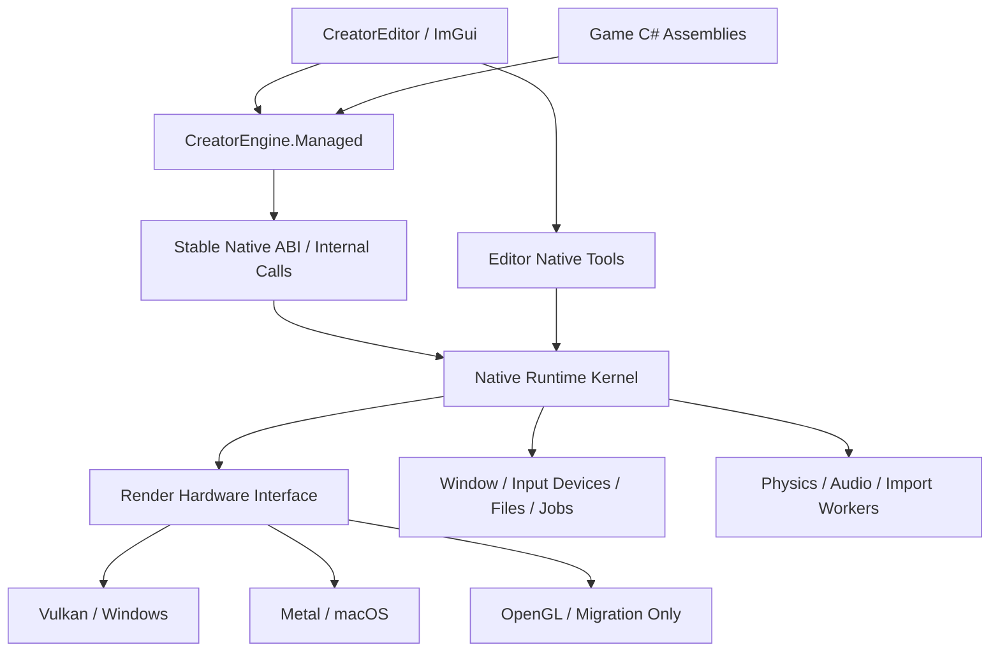
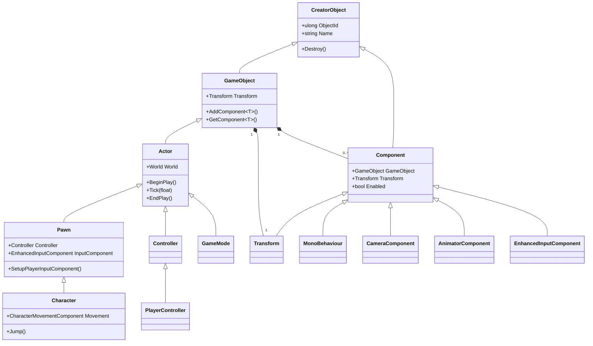
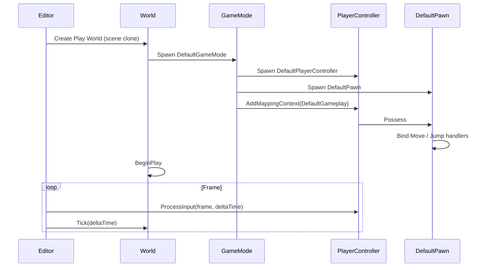
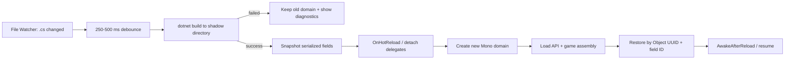
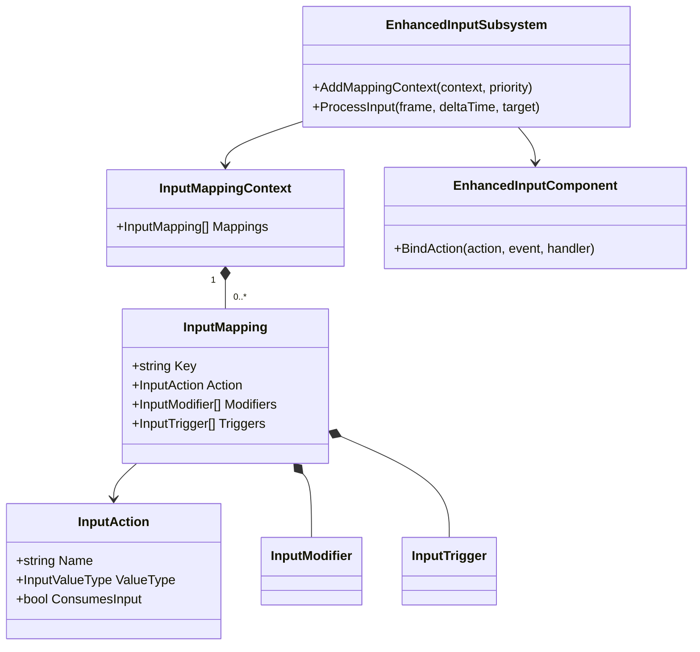
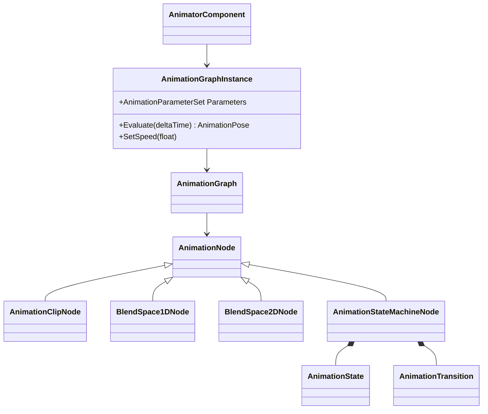

# CreatorEngine 混合架构设计

> 文档状态：Architecture Baseline 0.1  
> 目标平台：Windows 10/11、macOS 13+  
> 托管玩法层：C#、`netstandard2.0` 起步、Mono embedding 运行时  
> 原生平台层：C++17、Vulkan（Windows）、Metal（macOS）  
> 当前迁移后端：OpenGL 3.3

## 1. 目标与非目标

CreatorEngine 是一套“Unity 组合模型 + Unreal Gameplay Framework”的托管优先游戏引擎：

- 用 Unity 风格 `GameObject + Component + Transform` 组织场景和编辑器层级。
- 用 UE 风格 `Actor -> Pawn -> Character` 表达玩法语义和深层继承。
- 用 `GameMode + PlayerController + DefaultPawn` 提供开箱即玩的默认世界。
- 用 Mono C# 作为唯一官方玩法脚本语言；编辑器扩展和资产管线也优先使用 C#。
- 用稳定的 Native ABI 隔离 C# 与 Vulkan/Metal、窗口、文件系统和高性能资源代码。
- 保留数据导向优化入口；不要求所有运行时对象都经过深继承树。

本设计不尝试逐行复制 Unity 或 UE，也不在第一阶段实现完整 AAA 渲染器、Nanite、Lumen 或完整 DCC。目标是先得到边界稳定、可持续扩展的小型编辑器和运行时。

## 2. 当前实现与目标状态

| 能力 | 当前仓库 | 本次新增 | Alpha 目标 |
| --- | --- | --- | --- |
| Unity 风格编辑器布局 | 已实现 ImGui Docking 工作区 | 保持 | 完善快捷键、Gizmo、布局持久化 |
| Hierarchy | 任意深度、拖拽重挂、递归序列化 | 保持 | Prefab、Undo/Redo、多选 |
| Scene 2D/3D | 已有按钮、正交/透视编辑器相机 | 保持 | Gizmo 约束、模式持久化 |
| C# 生命周期 | 可选 Mono，支持生命周期和 Position | 扩展托管 API 骨架 | ScriptDomain 热重载、字段反射、调试 |
| 混合对象模型 | 原生 GameObject/Component | 新增可编译 C# 模型 | 与原生 Scene/句柄表完全桥接 |
| 默认可玩世界 | 未接入原生 Play | 新增托管 Bootstrap | Play 时自动实例化并可控制 |
| Enhanced Input | 原生键盘布尔状态 | 新增托管运行时骨架 | 编辑器资产、手柄、重绑定、持久化 |
| Animation Graph | 未实现 | 新增状态机/Blend Space 骨架 | 图编辑器、骨骼 Pose、GPU Skinning |
| 渲染后端 | OpenGL 3.3 | 设计 RHI 边界 | Vulkan + Metal，OpenGL 作为迁移后端 |
| 内置建模/绘制 | 未实现 | 定义工具架构 | 基础体、Push/Pull、顶点色/贴图绘制 |

“本次新增”表示托管程序集内已有可编译的基础逻辑，不表示它已经接入当前 C++ Scene、Inspector 或原生输入循环。

## 3. 总体分层



### 3.1 托管层职责

- `CreatorObject`、`GameObject`、`Component`、`Actor`、`Pawn`、`Character`。
- World/GameMode/Controller 生命周期与玩法规则。
- Enhanced Input 的 Action、Mapping Context、Modifier、Trigger 和 C# 事件绑定。
- Animation Graph 数据模型、参数、状态机和 Blend Space 评估调度。
- Inspector 元数据、序列化声明、编辑器命令和项目模型。
- 项目 C# 程序集生成、编译、诊断和热重载事务。

### 3.2 原生层职责

- GLFW 窗口和操作系统事件；后续可替换为更薄的平台窗口层。
- Vulkan/Metal 设备、交换链、命令队列、资源分配和同步。
- Mesh、Texture、Shader、Pipeline 等 GPU 对象的实际所有权。
- 帧图、批处理、GPU Skinning、纹理绘制 Render Pass。
- 物理、音频、文件监控和后台导入任务的高性能实现。
- 用版本化句柄表向 C# 暴露资源，禁止托管代码长期持有裸指针。

### 3.3 ABI 原则

```csharp
// C# 只持有带 generation 的逻辑句柄。
public readonly struct NativeHandle
{
    public readonly uint Index;
    public readonly uint Generation;
}
```

```cpp
// Native API 只传 POD、句柄和显式长度；不跨边界传 STL/异常。
extern "C" CreatorResult CE_Transform_GetPosition(
    CreatorHandle object, CreatorVector3* outPosition);
```

- ABI 调用返回错误码，托管包装器转换为明确异常或 Result。
- Native 对象销毁后 generation 增加，旧句柄访问得到 `InvalidHandle`。
- 高频数据使用批量接口或映射缓冲，不为每个骨骼/顶点做一次 internal call。
- Mono domain 卸载前断开全部托管委托，防止原生层调用已卸载方法。

## 4. 对象模型

### 4.1 继承与组合关系



`Actor` 继承 `GameObject`，因此 UE 风格深继承对象天然拥有 Unity 风格组件能力。普通场景装饰也可以只用 `GameObject`，不必承担 Gameplay Framework 生命周期。

### 4.2 核心约束

1. 每个 `GameObject` 构造时自动创建且只创建一个 `Transform`。
2. Component 只能属于一个 GameObject，不能跨对象共享实例。
3. Transform 负责层级；重挂时拒绝自身/子孙循环，并可保持世界坐标。
4. World 拥有 Actor；Actor 拥有 Component。销毁按相反方向、且必须幂等。
5. Actor 深继承用于语义和默认行为，功能扩展优先 Component，避免继续制造宽而脆弱的继承树。
6. 编辑器选择项使用稳定 UUID；运行时可另外分配紧凑 `ObjectId/NativeHandle`。

### 4.3 C# 基础实现骨架

完整可编译代码位于 `managed/CreatorEngine.Managed/Core` 与 `Gameplay`。核心接口为：

```csharp
public class GameObject : CreatorObject
{
    public Transform Transform { get; }
    public T AddComponent<T>() where T : Component, new();
    public Component AddComponent(Type type);
    public T? GetComponent<T>() where T : Component;
}

public class Actor : GameObject
{
    public World? World { get; internal set; }
    public virtual void BeginPlay();
    public virtual void Tick(float deltaTime);
    public virtual void EndPlay();
}

public class Pawn : Actor
{
    public Controller? Controller { get; }
    public EnhancedInputComponent InputComponent { get; }
    public virtual void SetupPlayerInputComponent(EnhancedInputComponent input);
}

public class Character : Pawn
{
    public CharacterMovementComponent Movement { get; }
    public virtual void Jump();
}
```

`MonoBehaviour : Component` 保留当前原生宿主使用的 `NativeHandle` 字段。宿主已经沿继承链反射字段和生命周期方法，因此此调整不破坏 `VerticalBob` 示例。

## 5. 默认世界与 Play

### 5.1 必备对象

空项目第一次打开就包含逻辑上的 `DefaultWorld`。按 Play 时，若场景未配置自定义类，使用：

- `DefaultGameMode`
- `DefaultPlayerController`
- `DefaultPawn`（当前骨架继承 Character）
- `CharacterMovementComponent`
- `CameraComponent`
- `EnhancedInputComponent`
- `DefaultGameplay` Input Mapping Context

### 5.2 启动序列



当前托管入口是：

```csharp
World world = DefaultWorldBootstrap.CreatePlayableWorld();
world.PrimaryPlayerController!.ProcessInput(inputFrame, deltaTime);
world.Tick(deltaTime);
```

编辑器接入时必须克隆 Edit World 为 Play World。Stop 直接销毁 Play World，不把运行时修改污染回编辑场景；“Apply Runtime Changes”应是显式命令。

## 6. Editor 设计

### 6.1 Unity 风格默认布局

```text
+----------------------+--------------------------------+------------------+
| Hierarchy            | Scene | Game                   | Inspector        |
|                      | [Move][Rotate][Scale] [2D][3D] |                  |
| World                |                                | Transform        |
|  - Actor             |        viewport                | Components       |
|    - Child           |                                | Add Component    |
+----------------------+--------------------------------+------------------+
| Project                                      | Console              |
+---------------------------------------------------------------------+
```

- Hierarchy：任意深度、过滤、多选、拖拽重挂、Prefab 标记。
- Scene：编辑器相机、Gizmo、网格、吸附、局部/世界坐标切换。
- Game：只显示游戏相机输出，独立 Framebuffer。
- Inspector：反射 C# `[SerializeField]`、公开属性和自定义 Drawer。
- Project：基于 Asset Database，不直接把操作系统目录当最终数据模型。
- Console：合并原生日志、C# 异常、编译诊断，支持双击定位。

### 6.2 2D/3D 模式

Scene 顶部使用互斥分段按钮 `2D | 3D`：

| 行为 | 2D | 3D |
| --- | --- | --- |
| 编辑器相机 | Orthographic | Perspective |
| 朝向 | 看向 XY 平面 | 自由 Orbit/Fly |
| Gizmo | 隐藏或锁定 Z 平移/旋转 | 完整 XYZ |
| 网格 | XY | XZ |
| 对 Scene 资产的影响 | 无 | 无 |
| 对游戏 Camera 的影响 | 无 | 无 |

切换只改变 `SceneViewState`，绝不能批量修改场景对象或游戏 Camera。每个项目保存 `SceneViewState.json`，不进入运行时场景序列化。

## 7. C# 编译、IDE 与热重载

### 7.1 工程模型

- `CreatorEngine.Managed.dll`：稳定的公开 API。
- `CreatorGame.dll`：项目脚本，每次编辑编译。
- `CreatorEditor.dll`：仅编辑器加载，不打包进 Player。
- 游戏项目初期目标 `netstandard2.0`，保证经典 Mono embedding 可加载。
- 编译由已安装的 `dotnet` SDK 驱动，执行环境由嵌入式 Mono 提供；两者不要混为同一个宿主。

### 7.2 `.sln` 生成

双击 `.cs` 时执行 `SolutionGenerator.EnsureUpToDate()`：

1. 扫描 `Assets/**/*.cs`、Assembly Definition 和插件引用。
2. 生成 `Intermediate/ProjectFiles/CreatorGame.csproj`，引用稳定 API DLL。
3. 生成或更新根目录 `CreatorEngine.sln`，不覆盖用户自定义项目属性。
4. Windows 依次检测用户配置、`code.cmd/Code.exe`、`vswhere.exe` 的 VS2022。
5. macOS 依次检测用户配置、`code` 和 `/Applications/Visual Studio Code.app`。
6. 用文件路径和行号启动 IDE；失败时在 Editor Preferences 显示可修复的选择项。

IDE 优先级必须可配置，自动检测结果只作为首次默认值。

### 7.3 热重载事务

经典 Mono 不能从同一 AppDomain 卸载单个程序集，因此热重载单位是独立 `ScriptDomain`：



事务要求：

- 编译失败继续运行旧程序集，绝不把 Play 状态置空。
- DLL/PDB 先写入带版本号的 shadow 目录，避免 Windows 文件锁。
- 字段键使用 `DeclaringType + FieldName + SerializedFormerNames`，支持字段改名迁移。
- 不保存静态字段、事件委托、线程和 native pointer。
- 重载前暂停 World Tick，等待托管 Job 安全点，解除所有 native callback。
- 新域加载或恢复失败时回滚旧域；成功后才卸载旧域。
- 当前 `MonoRuntime` 仍使用单一 root domain 和程序集缓存，尚不具备上述热重载保证。

## 8. Enhanced Input

### 8.1 数据模型



UE5 的准确语义是：

- Modifier 改写值：`DeadZone`、`Scalar`、`Negate`、`Swizzle`。
- Trigger 决定事件时机：`Pressed`、`Released`、`Hold`、`Tap`。

Hold/Tap 不属于 Modifier。CreatorEngine 保持这一职责划分，同时覆盖规格中的所有行为。

### 8.2 帧处理顺序

1. Native 设备层采集键鼠/手柄，生成不可变 `InputFrame`。
2. 按优先级从高到低遍历 Mapping Context；UI、载具、Gameplay 可动态压栈。
3. 读取 Mapping 的物理 Key 值。
4. 顺序执行 Modifiers。
5. 执行 Triggers，并在 Subsystem 内保存每位玩家独立的 trigger runtime state。
6. 聚合同一 Action 的多个 Mapping，例如 WASD 合成 Axis2D。
7. 生成 Started/Ongoing/Triggered/Completed/Canceled。
8. `EnhancedInputComponent` 将事件直接分发给 Pawn 的 C# 方法。

```csharp
public override void SetupPlayerInputComponent(EnhancedInputComponent input)
{
    input.BindAction(MoveAction, InputTriggerEvent.Triggered, OnMove);
    input.BindAction(JumpAction, InputTriggerEvent.Triggered, _ => Jump());
    input.BindAction(JumpAction, InputTriggerEvent.Completed, _ => StopJumping());
}
```

Alpha 前补齐：Input Action/Mapping Context 资产编辑器、手柄枚举、轴曲线、Chord/Combo、运行时改键、冲突提示和用户配置持久化。

## 9. Animation Graph

### 9.1 运行时模型



- `AnimationGraph` 是不可变资产定义；不能把当前状态存进共享资产。
- `AnimationGraphInstance` 每个 Animator 一份，保存参数和节点 runtime state。
- Graph 评估输出加权 Clip/Pose 描述，原生 Animation Runtime 完成骨骼采样和混合。
- C# 可直接调用 `animator.SetSpeed(speed)` 或命名参数 API。
- State Transition 支持条件、退出时间和过渡时长。
- 1D Blend Space 做相邻线性插值；当前 2D 骨架采用最近三点反距离权重，Alpha 阶段替换为离线三角剖分和重心插值。

### 9.2 可视化编辑器

Animation Blueprint 窗口由以下区域组成：

- Graph Canvas：节点、Pin、连线、框选、缩放和平移。
- Parameters：Float/Integer/Boolean/Trigger。
- Details：当前节点和 Transition 条件。
- Preview：骨骼网格、时间线、参数实时调试。
- Compiler Results：断链、类型不匹配、不可达状态和循环依赖诊断。

图资产保存为稳定 GUID 引用的 JSON/二进制中间格式。保存时编译为扁平节点表和拓扑顺序，运行时不遍历编辑器对象模型。

## 10. 资源系统与一体化美术工具

### 10.1 Asset Database

每个源文件配套 `.meta`，内含稳定 GUID、Importer 类型、导入设置和依赖哈希：

```text
Assets/Textures/Hero.png
Assets/Textures/Hero.png.meta
Library/Artifacts/ab/cd/<content-hash>.texture
```

拖图片到 Project：

1. 复制或移动到 `Assets`，立即创建 `.meta`。
2. 根据扩展名选择 `TextureImporter`。
3. Inspector 选择 `Texture2D` 或 `Sprite (2D)`、sRGB、Alpha、压缩和 Pixels Per Unit。
4. 后台导入到 Library；主线程只提交 GPU Upload。
5. Asset GUID 不随重命名或移动变化，场景引用不会断裂。

### 10.2 基础建模

- Primitive Factory：Cube、Sphere、Cylinder；创建参数化源 Mesh。
- Mesh Edit Mode：Object/Vertex/Edge/Face 四种选择层级。
- Push/Pull：沿平均法线挤压选中面，产生一条可撤销命令。
- 所有修改通过 `IEditorCommand`，支持 Undo/Redo 和合并连续拖动。
- 保存时生成新的 Mesh Asset；场景对象只引用 Asset GUID。
- MVP 不做复杂布尔、UV 展开、雕刻和拓扑重建。

### 10.3 Texture Painting

- Vertex Color：拾取三角形，按笔刷半径/衰减修改顶点 RGBA，上传动态 Vertex Buffer。
- Texture Paint：在 UV 空间建立离屏 Render Target，将笔刷 stamp 投影到命中三角形。
- 用 Ping-Pong 纹理保存笔画，结束笔画后异步读回并生成可撤销差异块。
- 自动保存前写临时文件并原子替换，避免编辑器崩溃破坏源图。
- 无 UV 的 Mesh 只开放 Vertex Color，并在 Inspector 给出明确诊断。

## 11. Vulkan / Metal RHI

### 11.1 公共接口

```csharp
public interface IRenderDevice
{
    GraphicsBackend Backend { get; }
    BufferHandle CreateBuffer(in BufferDescription description);
    TextureHandle CreateTexture(in TextureDescription description);
    PipelineHandle CreateGraphicsPipeline(in GraphicsPipelineDescription description);
    ICommandList CreateCommandList();
    void Submit(ICommandList commands, FenceHandle signalFence);
}
```

公开的 C# 类型只是命令和描述；设备对象在原生层。RHI 最小集合：

- Instance/Adapter/Device/Queue
- Swapchain/Surface
- Buffer/Texture/Sampler
- ShaderModule/Pipeline/DescriptorSet
- CommandList/Fence/Semaphore
- RenderPass 或 Dynamic Rendering 抽象
- GPU Upload/Staging 和 deferred destruction

### 11.2 后端映射

| RHI | Vulkan | Metal |
| --- | --- | --- |
| CommandQueue | VkQueue | MTLCommandQueue |
| CommandList | VkCommandBuffer | MTLCommandBuffer + Encoder |
| Pipeline | VkPipeline | MTLRenderPipelineState |
| DescriptorSet | VkDescriptorSet | Argument Buffer / Resource Binding Table |
| Fence | VkFence/Timeline Semaphore | MTLSharedEvent/Completion Handler |
| Texture | VkImage | MTLTexture |

Shader 源建议以 HLSL 为作者格式：Windows 编译 SPIR-V；macOS 通过 SPIRV-Cross 生成 MSL。编译产物按源哈希、宏、后端、编译器版本缓存。Alpha 前不要允许业务 C# 直接调用 Vulkan/Metal API。

### 11.3 帧调度

采用 2-3 帧 in-flight：

1. 等待当前 FrameContext fence。
2. 释放该帧延迟销毁资源。
3. 构建 Render World 快照，不让渲染线程直接遍历可变 GameObject。
4. Frame Graph 编译资源生命周期、barrier 和 pass 顺序。
5. 并行录制命令，提交 Graphics/Transfer 队列。
6. Present；设备丢失进入可恢复错误路径。

## 12. 序列化、反射与线程模型

### 12.1 序列化

- Scene、Prefab、Input、Animation Graph 全部包含 `formatVersion`。
- 对象引用用 GUID，不保存内存地址、列表下标或 C# hash code。
- C# 字段默认只序列化公开字段和 `[SerializeField]` 私有字段。
- `[NonSerialized]`、静态、只读、委托、线程和原生临时对象不保存。
- 提供 `[FormerlySerializedAs]` 和逐版本迁移器。

### 12.2 Inspector 反射

程序集加载后一次性建立 `TypeRegistry`，缓存字段、属性、Attribute 和 Drawer；每帧 Inspector 不做全程序集扫描。所有属性修改走 Property Command，统一支持 Undo、Prefab Override 和多选。

### 12.3 线程

- Main Thread：World 生命周期、C# Gameplay、Editor UI。
- Render Thread：Frame Graph 编译和提交。
- Worker Pool：导入、动画采样块、物理准备、资源解压。
- File Watcher Thread：只投递事件，不直接调用 Mono。
- Mono domain 创建、卸载和 managed callback 切换必须在 Main Thread 安全点完成。

## 13. 目标目录树

这是渐进迁移后的目标结构，不要求一次重排当前仓库：

```text
CreatorEngine/
|-- CMakeLists.txt
|-- CreatorEngine.sln                 # 自动生成，不作为架构真源
|-- README.md
|-- AGENTS.md
|-- docs/
|   |-- CREATORENGINE_ARCHITECTURE.md
|   |-- SERIALIZATION_FORMAT.md
|   `-- NATIVE_ABI.md
|-- engine/
|   |-- CMakeLists.txt
|   `-- source/
|       |-- core/                     # 句柄、原生 Scene 桥、Job、ProjectPaths
|       |-- platform/
|       |   |-- windows/
|       |   `-- macos/
|       |-- rhi/
|       |   |-- RHI.*
|       |   |-- vulkan/
|       |   |-- metal/
|       |   `-- opengl/               # 迁移期
|       |-- renderer/                 # FrameGraph、RenderWorld、2D/3D passes
|       |-- resources/                # AssetDatabase native worker、GPU upload
|       |-- animation/                # Skeleton/Pose/Skinning native runtime
|       |-- physics/
|       |-- audio/
|       |-- scripting/                # MonoHost、ScriptDomain、InternalCalls
|       `-- editor/                   # ImGui shell、viewport、native tools
|-- managed/
|   |-- CreatorEngine.Managed/
|   |   |-- Core/                     # CreatorObject/GameObject/Component/Transform
|   |   |-- Gameplay/                 # Actor/Pawn/Character/World/GameMode
|   |   |-- Input/                    # Enhanced Input
|   |   |-- Animation/                # Graph/StateMachine/BlendSpace
|   |   |-- Rendering/                # RHI descriptions and handles
|   |   |-- Assets/
|   |   |-- Serialization/
|   |   `-- Interop/
|   |-- CreatorEngine.Editor.Managed/
|   |   |-- Inspector/
|   |   |-- ProjectModel/
|   |   |-- SolutionGenerator/
|   |   |-- AnimationGraphEditor/
|   |   `-- Tools/
|   `-- CreatorEngine.BuildTool/
|-- source/                            # 当前示例 Native Host，迁移后变 Player launcher
|-- Assets/
|   |-- Scenes/
|   |-- Scripts/
|   |-- Input/
|   |-- Animations/
|   |-- Meshes/
|   |-- Materials/
|   |-- Textures/
|   `-- Editor/
|-- Config/
|   |-- DefaultEngine.json
|   |-- DefaultInput.json
|   `-- EditorPreferences.json
|-- Intermediate/                     # 自动生成 project files / shadow assemblies
|-- Library/                          # 导入缓存，不提交
|-- Bin/
|-- tests/
|   |-- Native/
|   |-- Managed/
|   |-- Serialization/
|   `-- Rendering/
|-- ThirdParty/
`-- .vscode/                           # 平台分支专用任务
```

## 14. 开发路线图

### Phase 0：稳定当前基线（已基本完成）

- Unity 风格 Docking 布局、Hierarchy、Inspector、Project、Console。
- 独立 Scene/Game Framebuffer，Scene 2D/3D 编辑器相机切换。
- 递归层级和版本化 JSON。
- 可选 Mono 生命周期与 Transform Position internal calls。
- C++ 层级/序列化测试和双构建链验证。

退出条件：Windows 构建通过、CMake 测试通过、无层级循环或递归删除回归。

### Phase 1：MVP Gameplay（4-6 周）

- 将本次 C# 对象模型与原生 Scene 通过句柄表连接。
- Editor Play 克隆 Edit World；Stop 丢弃 Play World。
- 接入 DefaultWorldBootstrap，按 Play 可用 WASD 移动、Space 跳跃。
- Inspector 反射 C# 字段并保存基础类型、Vector 和对象引用。
- Native InputManager 扩为设备帧并桥接 Enhanced Input。

退出条件：新建空项目不配置任何对象，按 Play 后可控制默认角色；保存/加载后引用稳定。

### Phase 2：MVP Scripting（4-5 周）

- `ScriptDomain`、shadow copy、文件监控和编译诊断。
- `.sln/.csproj` 生成，VS Code/VS2022 自动检测与打开。
- 热重载字段快照、委托解绑、失败回滚。
- C# 异常堆栈映射到源码和 Console 双击定位。

退出条件：Play 中修改角色速度，编译成功后状态不丢失且新逻辑生效；编译失败时旧游戏继续运行。

### Phase 3：3D 与 RHI MVP（8-12 周）

- 建立 RHI 资源/命令/同步接口和 Render World 快照。
- Windows Vulkan：Swapchain、Mesh、Texture、Depth、基础 PBR、ImGui。
- macOS Metal：实现相同 RHI 合约。
- Shader 交叉编译和 Pipeline Cache。
- 保持 OpenGL 后端直到 Vulkan/Metal 通过图像回归测试。

退出条件：同一测试场景在 Vulkan/Metal 输出一致；窗口 resize、最小化、设备重建无崩溃。

### Phase 4：Animation Graph MVP（6-8 周）

- 骨骼/AnimationClip 导入、Pose 缓存、GPU Skinning。
- Graph Canvas、State Machine、Transition 和参数调试。
- Blend Space 1D/2D，2D 使用三角剖分和重心插值。
- AnimatorComponent 与 C# 参数 API 完整接入。

退出条件：DefaultCharacter 在 Idle/Walk/Run/Jump 间平滑切换，参数可在 Inspector 和 C# 同时驱动。

### Phase 5：一体化美术与 Alpha（8-10 周）

- Primitive、Vertex/Edge/Face 选择、Push/Pull、Undo/Redo。
- Vertex Color 与 Texture Painting、笔刷资产和自动保存。
- 图片拖拽导入、Sprite Editor、Atlas 基础支持。
- Prefab、Undo/Redo、多选 Inspector、资源依赖重导入。
- 性能分析、崩溃恢复、项目升级器和打包流程。

Alpha 退出条件：

- 可以只用 CreatorEditor 制作并打包一个包含 2D UI、3D 角色、输入、动画和 C# Gameplay 的小型关卡。
- Windows Vulkan 和 macOS Metal 都能运行同一项目。
- 连续编辑/Play/热重载 2 小时无不可恢复崩溃或资源引用损坏。
- 核心序列化、输入状态、热重载、RHI 资源生命周期和图编译器有自动化测试。

## 15. 当前仓库的迁移顺序

1. 不立即改目录；先让 `managed/CreatorEngine.Managed` 成为稳定 API 程序集。
2. 用 `NativeHandleRegistry` 替换 C# 当前接收的裸 `GameObject*` 数值句柄。
3. 把原生 Scene 的创建/销毁/Transform 逐项接到托管 World，而非维护两套权威对象树。
4. 将当前 `InputManager` 变成 Native Device Backend，事件语义全部交给 C# Enhanced Input。
5. 新建 RHI 接口，让现有 OpenGL Renderer 先实现 RHI，再并行增加 Vulkan/Metal。
6. 完成 Play World 隔离后再做热重载，否则无法可靠恢复对象和字段。
7. Animation Graph 先输出 Clip 权重，再接骨骼 Pose；图编辑器与运行时编译格式分离。
8. 美术工具最后建立在稳定的 Asset Database、Undo/Redo 和 RHI picking 之上。

这条顺序保留当前可运行编辑器，每个阶段都能构建和演示，避免一次性重写造成长期不可用。

## 16. 架构决策摘要

- **ADR-001**：托管玩法层 + 原生平台/RHI 层，不把 Vulkan/Metal 驱动实现为业务 C#。
- **ADR-002**：Actor 继承 GameObject，组件既可挂普通对象也可挂 Gameplay 对象。
- **ADR-003**：GameMode/Controller/Pawn 是默认世界服务，不要求用户手工搭建。
- **ADR-004**：Scene 2D/3D 是编辑器视图状态，不是两种互斥 Scene 类型。
- **ADR-005**：Mono 热重载以 domain 为事务单位，编译失败保留旧域。
- **ADR-006**：Input Modifier 改值，Trigger 决定时机，按 UE5 语义实现。
- **ADR-007**：Animation Graph 资产与 Instance runtime state 分离。
- **ADR-008**：资源引用统一使用 GUID，原生运行时引用统一使用 generation handle。
- **ADR-009**：OpenGL 是迁移后端，直到 Vulkan/Metal 达到功能与测试等价后才移除。
